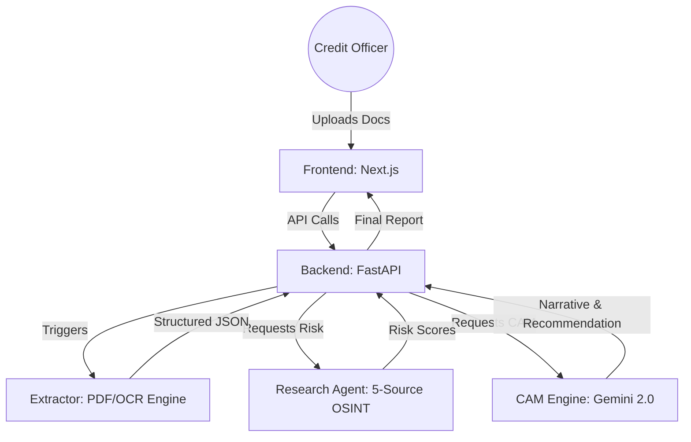

# 🚀 Intelli-Credit: AI-Powered Credit Decisioning Engine

Intelli-Credit is a next-generation, automated credit appraisal and due-diligence platform designed for Indian SME lending. It combines deep document intelligence with real-time regulatory research to provide a comprehensive risk profile and a fully automated **Credit Appraisal Memo (CAM)** within seconds.

---

## 🏗️ Architecture Overview

The system follows a **distributed microservices architecture** that seamlessly integrates document extraction, regulatory research, and LLM-powered narrative generation.



### 1. 📂 Ingestion Layer (`/extractor`)
*   **Intelligent Router:** Detects file types (PDF, XLSX, Scanned Images) and routes to specialized extractors.
*   **LLM Structuring:** Uses Claude/GPT-4o to transform raw text into a strict bank-grade JSON schema.
*   **Financial Validation:** Automatically verifies balance sheets against P&L statements.

### 2. 🔍 Research Agent (`/research_agent`)
*   **5-Source Orchestrator:** Concurrent async lookups across **RBI** (Wilful Defaulters), **MCA21** (ROC filings), **eCourts** (Litigation), **GSTN** (Status), and **News** (Tavily/Fraud Signals).
*   **Risk Scoring:** Computes a composite risk score (0-100) and assigns risk bands (Green, Amber, Red, Black).

### 3. 🧠 CAM Engine (`/cam_engine`)
*   **Automated Narrative:** Uses Gemini 2.0 Flash to generate detailed credit stories, management analysis, and industrial outlooks.
*   **Dynamic Pricing:** Calculates interest rates based on RBI Repo Rate + Risk Premium.
*   **Section-Wise Report:** Generates a full 7-section Credit Appraisal Memo (CAM) ready for bank approval.

### 4. 🖥️ Unified Dashboard (`/frontend`)
*   **Real-time Tracking:** Monitor the extraction and research pipeline as it happens.
*   **Decision Support:** Visual cues for risk alerts and "Hard-Stop" violations.
*   **Interactive CAM:** Edit or export generated memos directly from the browser.

---

## 🛠️ Quick Start

### ⚡ One-Click Startup (Windows)
We provide a unified batch script to launch all services simultaneously.
1. Ensure you have Python 3.11+ and Node.js installed.
2. Run the startup script:
   ```bash
   ./start_all.bat
   ```
3. Open **http://localhost:3000** in your browser.

### 🔧 Manual Setup
If you need to run services individually:

1.  **Backend:**
    ```bash
    cd backend && pip install -r requirements.txt
    python main.py
    ```
2.  **Research Agent:**
    ```bash
    cd research_agent && pip install -r requirements.txt
    python -m uvicorn api.main:app --port 8001
    ```
3.  **Frontend:**
    ```bash
    cd frontend && npm install && npm run dev
    ```

---

## 🔐 Environment Configuration
Each service requires its own `.env` file. Key variables include:
- `GEMINI_API_KEY`: For CAM narrative generation.
- `TAVILY_API_KEY`: For real-time news search.
- `JWT_SECRET`: For secure backend authentication.
- `DATABASE_URL`: For persistent storage (PostgreSQL recommended).

---

## ✅ Portfolio Progress: Milestone 3 Complete
- [x] **Full Pipeline Integration:** End-to-end flow from PDF upload to CAM generation.
- [x] **LLM Multi-Model Strategy:** Using specialized models for Extraction (Claude/GPT) and Narratives (Gemini).
- [x] **Unified Backend:** Central orchestrator for all microservices.
- [x] **Production UI:** Responsive Next.js dashboard with pipeline tracking.

---

**Developed for IIT Hackathon 2026**

